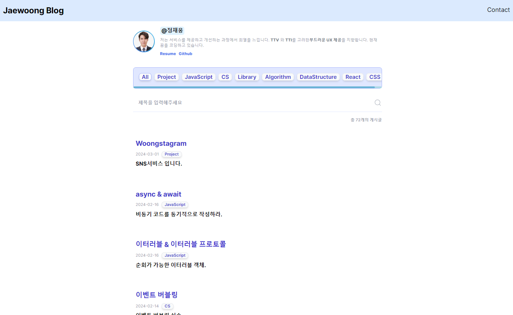

# 개발 블로그

---

> **Blog**   **개발기간 : 2024.01 ~ 2024.02**

#### 배포주소

---

> Web Page : https://dev-blog-green.vercel.app

### 프로젝트 소개

---

**개발 지식들을 저장하고 돌아보기위한 블로그입니다.**

웹 페이지는 다음과 같은 기능을 지원합니다.

1. 순간 검색기능
2. 개발자에게 메일 보내기 기능
3. Post 필터링 기능

 

### 시작 가이드

---

#### Requirements

For building and running the application you need:

- Node.js 18.13.0
- Npm 8.19.3
- Yarn 3.2.3

#### Installation

> $ git clone https://github.com/dixk3458/dev-blog.git  \$ cd dev-blog

 

### Stacks

---

#### Environment

#### Config

#### Development

 

### 화면 구성📺

    
    

 

### 개발 일지 📕

---

https://www.notion.so/Woong-s-29389eb3ae9742dfb722acf276ec872b?pvs=4
